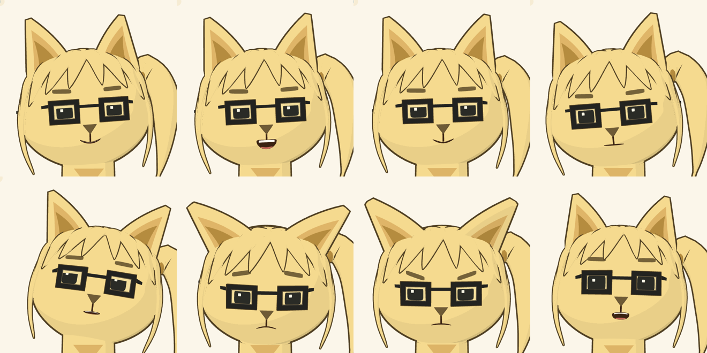

# Ludo 3D — la mascotte qui parle


Ludo en 3D temps réel (Three.js), fidèle au sprite pixel-art : oreilles de chat, frange, couette,
lunettes carrées, t-shirt brun avec le logo **FT**. Elle cligne des yeux, bouge les oreilles et la couette,
suit le pointeur du regard, et **parle avec une synchronisation labiale**. Elle est prête à brancher sur
une chaîne **speech-to-text → cerveau (LLM ou autre) → text-to-speech**.

Le modèle est 100 % procédural (aucun asset à télécharger) et s'exporte aussi en **`ludo.glb`**
pour Unity, Unreal, Godot, Blender…



## Démarrage

```bash
npm install
npm run dev          # démo sur http://localhost:5173
npm test             # tests unitaires (Node)
npm run build        # démo statique → dist-demo/
npm run build:lib    # bibliothèque ESM → dist/ludo-3d.js (three en dépendance externe)
npm run export:glb   # régénère public/ludo.glb
```

La démo permet de : faire parler Ludo (voix du navigateur), lui parler au micro, tester les
expressions / états / visèmes, faire du lip-sync sur un fichier audio ou sur le micro, et
télécharger le `.glb` ou une capture PNG.

## Utilisation en 3 lignes

```js
import { LudoAvatar } from 'ludo-3d';

const ludo = new LudoAvatar(document.getElementById('ludo'), { lang: 'fr-FR' });
await ludo.speak("[happy] Salut, moi c'est Ludo !");
```

Ou en composant web :

```html
<script type="module" src="ludo-3d/src/element.js"></script>
<ludo-avatar id="ludo" lang="fr-FR" framing="bust" style="height:480px"></ludo-avatar>
<script type="module">
  document.getElementById('ludo').speak('Bonjour !');
</script>
```

## Brancher le speech-to-text

`LudoConversation` enchaîne **écoute → réflexion → parole** et pilote les états de Ludo
(`listening` : oreilles dressées et tête penchée ; `thinking` : regard en l'air ; `speaking` : lip-sync).

```js
import { LudoAvatar, LudoConversation, BrowserSTT, BrowserTTS } from 'ludo-3d';

const ludo = new LudoAvatar(el);
const convo = new LudoConversation({
  rig: ludo.rig,
  stt: new BrowserSTT({ lang: 'fr-FR' }),     // Web Speech API (Chrome, Edge, Safari)
  tts: new BrowserTTS({ lang: 'fr-FR' }),
  respond: async (text, history) => {          // votre logique : LLM, règles, FAQ…
    const r = await fetch('/api/ludo', { method: 'POST', body: JSON.stringify({ text, history }) });
    return (await r.json()).text;              // peut contenir des balises [happy], [sad]…
  },
});
await convo.turn();   // un échange ; convo.start() pour une conversation continue
```

Chaque brique est remplaçable :

| Besoin | Classe | Notes |
| --- | --- | --- |
| STT du navigateur | `BrowserSTT` | `listenOnce()` → texte final ; évènement `transcript` pour l'intermédiaire |
| STT serveur (Whisper, Deepgram, Azure…) | `MicRecorder` | `record()` → `Blob` audio, coupe au silence ; à envoyer à votre API |
| STT perso | tout objet `{ listenOnce({ rig }) }` | appelez `rig.setState('listening')` pendant l'écoute |
| TTS du navigateur | `BrowserTTS` | gratuit ; lip-sync estimé depuis le texte, recalé sur les mots |
| TTS audio (OpenAI, ElevenLabs, Piper…) | `AudioTTS({ synthesize })` | `synthesize(text)` renvoie URL / Blob / ArrayBuffer ; lip-sync par analyse du signal |
| TTS avec visèmes (Azure, Polly) | `AudioTTS` → `{ audio, cues }` | synchro exacte ; convertir avec `eventsToCues(events, { map: AZURE_VISEME_MAP })` |
| Flux live (WebRTC, agent vocal) | `ludo.lipSyncStream(mediaStream)` | la bouche suit le flux en temps réel |
| Audio ponctuel | `ludo.playAudio(blobOuUrl)` | |

Un backend d'exemple qui fait répondre Ludo avec Claude est fourni dans
[`examples/server-claude.mjs`](examples/server-claude.mjs) (la clé API reste côté serveur) :

```bash
cd examples && npm install
ANTHROPIC_API_KEY=... node server-claude.mjs   # puis, dans la démo : mode « Endpoint HTTP »,
                                               # URL http://localhost:8787/api/ludo
```

## Expressions et états

```js
ludo.setExpression('happy');                       // neutral happy sad surprised angry thinking wink smug
ludo.setExpression('surprised', { duration: 2 });  // revient à neutral après 2 s
ludo.setState('listening');                        // idle listening thinking speaking
ludo.rig.lookAt(0.5, 0.2);                         // regard (x, y ∈ [-1, 1]) ; null = autonome
ludo.rig.twitchEar('L');
ludo.rig.setVisemes({ O: 1 });                     // contrôle manuel de la bouche (null pour rendre la main)
```

Dans un texte à prononcer, les balises `[happy]`, `[sad]`… changent l'expression au fil de la phrase :
il suffit de demander à votre LLM de les utiliser.

## Utiliser le modèle ailleurs

### `public/ludo.glb`

- Bas du buste à `y = 0`, unités en mètres environ (hauteur ≈ 2,3).
- Nœuds animables : `HeadPivot` (cou), `EarPivot_L`, `EarPivot_R`, `PonytailPivot`.
- Maillage `Ludo_Face` avec **31 morph targets** :
  - visèmes standard Oculus / OVR : `viseme_sil PP FF TH DD kk CH SS nn RR aa E I O U`
    (compatibles uLipSync, Oculus LipSync, Ready Player Me…) ;
  - blendshapes : `jawOpen mouthSmile mouthFrown mouthPucker eyeBlinkLeft eyeBlinkRight eyeWide eyeSquint
    eyesLookLeft eyesLookRight eyesLookUp eyesLookDown browUp browDown browSad browAngry`.
- Clips : `Idle`, `Blink`, `EarTwitch`, `Listening`, `TalkDemo`.

Dans Three.js, le même `LudoRig` anime aussi le modèle chargé :

```js
const gltf = await new GLTFLoader().loadAsync('ludo.glb');
scene.add(gltf.scene);
const rig = new LudoRig(gltf.scene);   // puis rig.update(dt) à chaque frame
```

### Dans votre propre scène Three.js

```js
import { buildLudo, LudoRig } from 'ludo-3d';
const model = buildLudo({ materials: 'toon', outlines: true });  // ou materials: 'standard'
scene.add(model);
const rig = new LudoRig(model);
// boucle : rig.update(dt)
```

## Architecture

```
src/
  avatar/
    buildLudo.js   modèle procédural (tête, oreilles, cheveux, lunettes, buste, logo)
    face.js        visage plaqué sur la tête + toutes les morph targets
    LudoRig.js     animation : clignements, regard, oreilles, couette, expressions, états, lip-sync
    geometry.js    utilitaires (surface de la tête, mèches effilées, contours)
    palette.js     couleurs extraites du sprite
  lipsync/
    visemes.js         liste de visèmes, texte → visèmes (règles FR), tables Azure / Polly / Rhubarb
    TimelineLipSync.js chronologie de visèmes (texte, évènements TTS)
    AudioLipSync.js    analyse audio temps réel (volume + spectre)
  conversation/
    speech.js            BrowserTTS, AudioTTS, BrowserSTT, MicRecorder
    LudoConversation.js  boucle écoute → réponse → parole, balises d'expression
  LudoAvatar.js    rendu clé en main (caméra, lumières, boucle, pointeur)
  element.js       composant web <ludo-avatar>
  exportGLB.js     export glTF binaire
```

## Limites connues

- `BrowserTTS` ne donne pas accès au signal audio : la bouche suit une estimation à partir du texte,
  recalée sur les mots quand le navigateur émet les évènements `boundary`. Pour une synchro parfaite,
  utilisez `AudioTTS`.
- La reconnaissance vocale du navigateur dépend de Chrome / Edge / Safari (pas Firefox) ;
  utilisez `MicRecorder` + un STT serveur pour couvrir tous les navigateurs.
- Le contour façon pixel-art n'existe qu'en temps réel (il n'est pas exporté dans le `.glb`).
